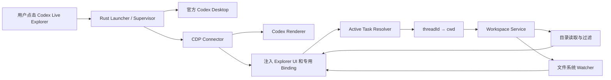
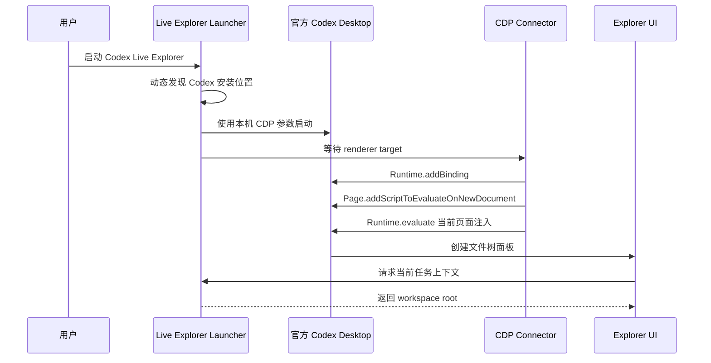

# Codex Live Explorer 设计提案

> 版本：0.1 Draft<br>
> 日期：2026-07-21<br>
> 首发平台：Windows 11<br>
> 项目形态：独立开源桌面增强工具<br>
> 集成方式：运行时 CDP 注入，不修改或重打包官方 Codex Desktop

## 1. 摘要

Codex Live Explorer 是一个面向 Codex Desktop 的轻量文件树增强工具。用户通过 `CodexLiveExplorer.exe` 启动官方 Codex Desktop 后，工具会在原有 Codex 窗口内注入一个可折叠、可调整宽度的项目文件树。

文件树自动跟随当前选中的 Codex 任务：任务切换到哪个本地项目或 worktree，文件树就切换到对应工作目录；当 Codex、外部编辑器或其他进程创建、修改、重命名、移动或删除文件时，界面实时刷新并标记变化。

首版仅展示目录和文件名，不读取文件正文，不提供编辑、删除或重命名能力。项目不依赖 Codex++，不复制第三方注入框架代码，也不修改官方 Codex 安装文件。

## 2. 背景与问题

Codex Desktop 以任务和对话为核心，适合委派、跟踪和审查 Agent 工作，但当前项目文件浏览体验并不稳定：

- 完整项目结构并非始终可见。
- 文件树入口可能随版本、布局或项目状态变化。
- 切换任务后，文件树可能仍指向旧项目。
- Agent 创建或移动文件后，树形结构可能不能及时刷新。
- 用户经常需要切换到 VS Code 或资源管理器确认项目结构。

相关公开反馈包括：

- [Toggle File Tree 显示不可靠](https://github.com/openai/codex/issues/20552)
- [创建、移动或删除文件后不能及时刷新](https://github.com/openai/codex/issues/20164)
- [切换项目后 Workspace Explorer 仍指向旧目录](https://github.com/openai/codex/issues/23797)
- [用户希望获得真正的内置文件树与编辑器](https://github.com/openai/codex/issues/19636)

本项目解决的核心问题不是“再做一个独立 IDE”，而是让用户在官方 Codex Desktop 中始终知道：

1. 当前任务对应哪个项目目录。
2. 项目包含哪些文件和文件夹。
3. Agent 工作期间，哪些路径刚刚发生了变化。

## 3. 目标与非目标

### 3.1 产品目标

1. 在官方 Codex Desktop 原窗口内增加文件树面板。
2. 用户启动 Live Explorer 时自动启动官方 Codex Desktop。
3. 自动识别当前任务的 `threadId` 和工作目录 `cwd`。
4. 切换任务时自动切换文件树，不需要手动选目录。
5. 监听项目文件系统变化并局部刷新树节点。
6. 以颜色或状态图标标记新增、修改、删除和重命名。
7. 不修改官方安装文件，卸载后官方 Codex 保持原样。
8. 对未知 Codex 版本安全失败，不破坏原界面。
9. 提供可验证的安全边界、兼容矩阵和自动化测试。

### 3.2 首版非目标

- 不读取或预览文件正文。
- 不提供代码编辑器。
- 不写入、删除、移动或重命名项目文件。
- 不实现全文搜索或语义索引。
- 不替代 Codex Desktop、VS Code 或其他 IDE。
- 不注入模型请求、不修改登录信息和模型配置。
- 不支持 Codex Cloud 项目或没有本地目录的普通聊天。
- 不在首版支持 macOS、Linux 和 SSH 远程工作区。

## 4. 用户体验设计

### 4.1 桌面布局

Live Explorer 作为原生任务侧栏和对话区域之间的新面板出现：

```text
┌──────────────┬────────────────────┬─────────────────────────────┐
│ Codex 原侧栏 │ Codex Live Explorer│ 当前对话                    │
│              │                    │                             │
│ 项目/任务    │ ▼ project-root     │ 用户消息                    │
│ 历史对话     │   ▶ src            │ Codex 回复                  │
│              │   ▶ tests          │ 工具调用                    │
│              │     README.md      │ 计划和进度                  │
│              │     package.json M │                             │
└──────────────┴────────────────────┴─────────────────────────────┘
```

设计原则：

- 默认宽度 260px。
- 支持拖动调整，建议范围 180px 至 480px。
- 支持一键折叠和恢复。
- 收起状态和宽度按用户保存。
- 使用独立 Shadow DOM，尽量避免与 Codex 样式冲突。
- 窗口过窄时切换为左侧抽屉，而不是遮挡对话输入框。

### 4.2 文件状态

| 状态 | 表现 | 建议颜色 |
|---|---|---|
| 新增 | 文件名和 `A` 标记 | 绿色 |
| 修改 | 文件名和 `M` 标记 | 黄色 |
| 删除 | 短暂保留并淡出，显示 `D` | 红色 |
| 重命名/移动 | 原路径与新路径短暂关联，显示 `R` | 蓝色 |
| 未变化 | 普通文件名 | 主题前景色 |
| 无法访问 | 锁图标和说明 | 灰色 |

状态标记应有图标或文本，不能只依赖颜色，以满足可访问性要求。

### 4.3 关键状态

- **项目已加载**：显示当前根目录名称和文件树。
- **正在切换任务**：保留旧树但降低透明度，显示加载状态。
- **无本地项目**：显示“当前任务未绑定本地项目”。
- **目录不可用**：显示路径已移动、删除或失去权限。
- **版本不兼容**：不注入完整面板，只显示可关闭的兼容性提示。
- **Codex 已在普通模式启动**：提示用户重启 Codex 以启用 Live Explorer。

## 5. 总体架构



系统由六个主要模块组成：

1. **Launcher / Process Supervisor**：发现、启动和监控官方 Codex Desktop。
2. **CDP Connector**：发现 renderer、建立 CDP 会话并处理重注入。
3. **Renderer Injector**：注入文件树 UI、样式和专用原生 Binding。
4. **Active Task Resolver**：识别当前选中任务并解析工作目录。
5. **Workspace Service**：安全地枚举目录、过滤路径并维护树缓存。
6. **File Watch Service**：监听路径变化、合并事件并驱动局部刷新。

## 6. 技术选型

### 6.1 原生部分

推荐使用 Rust，实现为单个后台可执行文件：

| 能力 | 推荐库/技术 |
|---|---|
| 异步运行时 | `tokio` |
| CDP WebSocket | `tokio-tungstenite` |
| HTTP 目标发现 | `reqwest` |
| JSON-RPC/CDP 消息 | `serde`、`serde_json` |
| 文件系统监听 | `notify` |
| `.gitignore` 规则 | `ignore` |
| 路径处理 | `dunce`、`std::fs::canonicalize` |
| 日志 | `tracing`，默认不记录项目文件名 |
| Windows 包检测 | Windows App SDK/PackageManager 或 WinRT API |

首版不需要 Tauri，因为项目不创建独立应用窗口；UI 被注入官方 Codex renderer，Rust 进程只承担启动、桥接和文件监听职责。

### 6.2 Renderer 部分

推荐使用 TypeScript，并编译为单个可注入资源：

- Custom Element：`<codex-live-explorer>`
- Shadow DOM：隔离样式和事件
- 轻量状态管理：自定义 store 或 Preact signals
- 虚拟列表：只渲染可见节点
- CSS 变量：适配 Codex 明暗主题
- `MutationObserver`：观察任务路由和 DOM 锚点变化

若功能只包含文件树，不建议引入完整 React 工程，以降低产物大小和注入复杂度。

## 7. 启动与注入流程



启动器必须：

1. 每次启动动态发现 Codex 包和可执行入口，不硬编码 WindowsApps 版本路径。
2. 将 CDP 绑定到 `127.0.0.1`。
3. 选择随机或冲突检测后的本地端口。
4. 验证 CDP target 属于刚启动或已授权的 Codex 进程。
5. renderer 重载或重建后自动重新注入。
6. Codex 退出后停止 watcher 并退出后台进程。

如果 Codex 已经在没有 CDP 的情况下运行，首版不尝试危险的进程注入，而是提示用户保存工作并自行确认重启。

## 8. 当前任务与项目目录解析

### 8.1 官方能力

Codex App Server 的线程对象包含稳定的 `cwd` 字段：

- `thread/list` → `result.data[].cwd`
- `thread/read` → `result.thread.cwd`
- `thread/started` → `params.thread.cwd`

官方协议来源：

- [Codex App Server](https://learn.chatgpt.com/docs/app-server.md)
- [`Thread` 数据结构](https://github.com/openai/codex/blob/main/codex-rs/app-server-protocol/src/protocol/v2/thread_data.rs)

App Server 没有 `activeThreadId` 或 `thread/select`。当前界面选中了哪个任务属于桌面客户端自己的 UI 状态，因此必须由注入层识别。

### 8.2 解析流程

```text
Codex 路由/选中任务变化
        ↓
Renderer Adapter 提取 threadId
        ↓
原生 Context Resolver 查询 thread cwd
        ↓
校验并 canonicalize workspace root
        ↓
取消旧 watcher，建立新 watcher
        ↓
清空旧树缓存并加载新根节点
```

### 8.3 适配器设计

```text
src/renderer/adapters/
├─ contract.ts
├─ codex-26.715.ts
├─ codex-next.ts
└─ fallback.ts
```

每个适配器负责：

- 判断当前页面是否为 Codex 本地任务。
- 定位稳定的页面容器。
- 取得当前任务 ID。
- 监听任务切换。
- 返回面板挂载位置。

适配器不得直接访问项目文件系统。未知版本或无法确定任务 ID 时必须 fail closed。

### 8.4 工作目录数据源

优先顺序：

1. 与当前 Codex 版本匹配的 App Server `thread/read`。
2. Codex 本地线程索引的只读兼容适配器。
3. 用户手动选择目录，仅作为开发或故障降级模式。

使用本地数据库作为兼容后备时，应隔离在版本化模块中，禁止把数据库 schema 当作稳定公共 API。

## 9. 文件树与实时监听

### 9.1 树数据模型

```ts
interface TreeNode {
  id: string;
  name: string;
  relativePath: string;
  kind: "directory" | "file" | "symlink";
  expanded: boolean;
  loaded: boolean;
  change?: "added" | "modified" | "deleted" | "renamed";
  children?: TreeNode[];
}
```

UI 永远只传相对路径。绝对根目录只保存在原生进程中。

### 9.2 懒加载

- 首次只读取项目根目录的直接子项。
- 用户展开文件夹时才枚举该目录。
- 折叠目录可保留有限缓存。
- 大目录分批返回，避免一次向 renderer 发送大量节点。
- 排序默认“目录优先、名称不区分大小写”。

### 9.3 忽略规则

默认行为：

- 遵循 `.gitignore`。
- 默认隐藏 `.git`、常见缓存和构建输出。
- 提供“显示隐藏文件”和“显示被忽略文件”开关。
- 不递归跟随 symlink 或 Windows junction。
- 对权限不足目录显示状态，不反复重试。

### 9.4 监听与事件合并

可使用 Rust `notify`，也可在兼容 App Server 环境中使用：

- `fs/watch`
- `fs/changed`
- `fs/unwatch`

协议定义见 [`fs.rs`](https://github.com/openai/codex/blob/main/codex-rs/app-server-protocol/src/protocol/v2/fs.rs)。

处理策略：

1. watcher 只发送变化路径，不发送文件内容。
2. 在 100–250ms 窗口内合并重复事件。
3. 只刷新变化路径的父目录。
4. rename 无法可靠成对识别时，退化为 delete + add。
5. 删除节点先标红，再短暂淡出，避免用户看不到变化。
6. watcher 溢出或丢失事件时，重新加载已展开目录，而不是扫描全仓库。

### 9.5 有界文本预览（实现修订）

用户明确选择文件或在聚焦文件上按 Enter 后，renderer 可调用专用的
`explorer.preview`。该接口不是通用 `readFile`：原生端最多采样 64 KiB 加
一个只用于判断截断的哨兵字节，正文最多返回前 64 KiB；文件更大时返回
`truncated: true`。只接受严格 UTF-8（允许开头的 UTF-8 BOM），包含 NUL、
非法 UTF-8 或二进制内容时不返回正文。

原生端采用不区分大小写的文本扩展名/文件名白名单，范围仅包括源代码、
脚本、纯文本/Markdown、Web 标记与样式、JSON/YAML/TOML/XML、SQL/CSV、
项目配置和构建文件。`.env*`、`.npmrc`、`.pypirc`、`.netrc`、`credentials`、
SSH 私钥名，以及私钥、证书、密钥库和密码库扩展名优先进入敏感文件黑名单。
完整、可测试的有效名单以 [`docs/protocol.md`](docs/protocol.md) 为准；UI
图标不能决定文件是否可预览。

预览仍使用 retained no-follow 目录能力逐级打开父目录，再相对父句柄打开
最终普通文件；symlink、junction 和其他 reparse point 一律拒绝。正文只能
通过 `textContent` 作为字面文本显示，不解析 HTML、Markdown 或 SVG，也不
写入设置、缓存或日志。预览文本会进入 Codex renderer 的内存和开放 Shadow
DOM；renderer 不是保密边界，同一 Windows 用户下能检查 CDP 的进程可能读取
已显示内容。选择文件只是 UI 约定而不是原生可验证的用户手势；持有有效
能力令牌的 renderer 可以请求任何通过原生预览策略的相对路径。敏感文件名
黑名单只是纵深防御，不是完整的秘密扫描器。

### 9.6 主窗口主题标签（交互修订）

文件预览不再停靠在文件树底部。首次选择普通文件后，Codex 主内容区顶部出现
主题标签栏：`Conversation` 固定在第一项，随后按打开顺序排列最多 8 个文件
标签。同一路径只保留一个标签；重新选择时切换到已有标签。文件标签激活时，
主内容区完整显示该文件的有界纯文本；切回 `Conversation` 时恢复原对话。

实现不移动、不克隆 Codex 的对话 DOM。文件激活期间仅用独立的主内容覆盖层
遮盖原界面，并把原直属内容暂时设为 inert/aria-hidden；切回对话、关闭最后
一个文件、任务切换、失配、关闭 Explorer 或 renderer 断开时，必须精确恢复
原属性并清空全部文件正文。方向键和 typeahead 只移动文件树焦点，单击文件或
按 Enter/Space 才打开标签；目录、过滤和折叠不会关闭已经打开的文件。

## 10. 原生桥接协议

推荐通过 CDP `Runtime.addBinding` 暴露单一专用 Binding，不建立无认证的 localhost HTTP 文件接口。

请求示例：

```json
{
  "id": "req-42",
  "method": "explorer.list",
  "params": {
    "relativePath": "src"
  }
}
```

首版允许的方法：

| 方法 | 用途 |
|---|---|
| `explorer.context` | 返回当前任务 ID、项目名称和根目录显示名 |
| `explorer.list` | 枚举某个相对目录的直接子项 |
| `explorer.preview` | 返回原生策略允许的、最多 64 KiB 的 UTF-8 文本预览 |
| `explorer.watch.start` | 启动当前 workspace watcher |
| `explorer.watch.stop` | 停止 watcher |
| `explorer.settings.get` | 读取面板宽度、折叠和过滤设置 |
| `explorer.settings.set` | 保存非敏感 UI 设置 |

通知示例：

```json
{
  "method": "explorer.changed",
  "params": {
    "changes": [
      { "relativePath": "src/app.ts", "kind": "modified" }
    ]
  }
}
```

首版明确不提供通用 `readFile`、`writeFile`、`remove`、`move` 和任意命令
执行接口；唯一的正文接口是上述固定策略的 `explorer.preview`。

## 11. 安全设计

### 11.1 威胁模型

主要风险：

- 本机其他同权限进程连接 CDP 调试端口。
- renderer 中不可信脚本调用原生 Binding。
- renderer 滥用预览读取任意文件，或检查已显示的敏感正文。
- 路径穿越访问 workspace 外部目录。
- symlink/junction 指向项目外部。
- 日志泄露项目名称或敏感文件名。
- 官方更新导致选择器命中错误 DOM。
- 恶意仓库通过超大目录或特殊文件名造成资源耗尽。

### 11.2 防护要求

1. CDP 只监听 `127.0.0.1`，不绑定局域网地址。
2. 启动器校验 CDP target 的进程 ID、页面类型和启动时间。
3. Binding 使用每次启动随机生成的能力令牌。
4. renderer 不允许指定绝对路径或 workspace root。
5. 绑定 canonical root，并以 retained no-follow 句柄逐级解析相对路径。
6. 最终文件也必须相对父句柄 no-follow 打开，且仍属于当前有效 root/context。
7. 拒绝 `..`、UNC、设备路径、ADS 和路径前缀混淆。
8. 不跟随逃出 root 的 symlink/junction。
9. 限制单目录最大返回节点数、请求频率和路径长度。
10. 默认日志只记录事件类型和错误码，不记录完整路径。
11. 适配器无法确认当前任务时停止工作，不猜测目录。
12. 首版保持严格只读。
13. 预览上限、文本白名单、敏感黑名单和 UTF-8/NUL 校验只能由原生端决定。
14. 预览正文不进入日志、设置或 watcher 通知，并只按字面文本渲染。

## 12. 性能设计

### 12.1 性能原则

- 不在启动时递归扫描完整仓库。
- 不把完整树一次性发送到 renderer。
- 使用懒加载和虚拟列表。
- 缓存已展开目录，设置节点和内存上限。
- watcher 事件合并后局部刷新。
- Git 状态扫描作为可选后续能力，不阻塞首屏。

### 12.2 建议验收目标

以下为工程目标，最终数字必须通过测试确定：

- renderer 准备完成后 2 秒内出现面板。
- 切换任务后 1 秒内显示新项目根节点或明确加载状态。
- 普通文件变化在 500ms 内反映到已展开目录。
- 包含 10 万路径的测试仓库仍能按需展开，而不执行全量 DOM 渲染。
- 面板折叠时停止不必要的 UI 渲染，但继续维护最小 watcher 状态。

## 13. 官方更新兼容策略

Live Explorer 安装在独立目录，不修改官方 Codex 文件，因此官方更新不会删除它。但更新可能改变 DOM、路由、renderer 或 CDP 行为，使面板暂时无法注入。

兼容措施：

1. 启动时读取官方 App 版本。
2. 维护明确的版本兼容矩阵。
3. 使用版本化 Renderer Adapter。
4. 至少提供三个低耦合挂载锚点或安全抽屉降级。
5. 注入脚本幂等，重复执行不创建多个面板。
6. renderer 重载后自动重注入。
7. 未知版本默认禁用，并链接兼容性 Issue 模板。
8. 保存最小 DOM fixture，执行 selector contract test。
9. 每个官方版本更新后运行自动 smoke test 和人工核验。
10. 不静默下载执行未签名的动态注入代码。

最坏情况下，如果官方完全禁止 CDP 或改变桌面技术架构，内嵌方案将停止工作，需要转向伴随窗口或等待新的受支持扩展接口。

## 14. 安装、启动与卸载

### 14.1 GitHub 发布物

建议每个正式版本提供：

- `CodexLiveExplorer-Setup-x64.exe` 或 `.msi`
- 可选便携版 ZIP
- `SHA256SUMS.txt`
- SBOM
- 对应 Git tag 的完整源码
- 支持版本和已知问题说明

### 14.2 安装行为

安装程序应：

1. 安装到用户级应用目录，不要求管理员权限。
2. 不复制或捆绑官方 Codex Desktop。
3. 创建“Codex Live Explorer”开始菜单和桌面快捷方式。
4. 提供可选的登录启动，不默认强制开启。
5. 提供一键禁用、诊断和完整卸载。
6. 保留官方 Codex 原快捷方式。

### 14.3 正常启动

用户点击 Live Explorer 快捷方式，工具启动官方 Codex 并完成注入。若用户通过官方快捷方式启动 Codex，则不会出现 Live Explorer，除非未来实现经用户授权的预启动后台助手。

### 14.4 卸载

卸载只删除 Live Explorer 自身程序、快捷方式和设置，不修改 Codex、本地项目或对话数据。

## 15. 仓库与许可证

推荐仓库：

```text
codex-live-explorer/
├─ README.md
├─ LICENSE
├─ SECURITY.md
├─ THIRD_PARTY.md
├─ CHANGELOG.md
├─ docs/
│  ├─ architecture.md
│  ├─ threat-model.md
│  ├─ compatibility.md
│  └─ prior-art.md
├─ crates/
│  ├─ launcher/
│  ├─ cdp-client/
│  ├─ context-resolver/
│  └─ workspace-service/
├─ packages/
│  └─ explorer-ui/
├─ tests/
│  ├─ security/
│  ├─ compatibility/
│  ├─ performance/
│  └─ e2e/
└─ .github/workflows/
```

若全部代码独立实现且不复制第三方受限代码，可考虑 MIT 或 Apache-2.0。仓库必须声明：

> Codex Live Explorer 是非官方社区项目，与 OpenAI 无隶属、合作或背书关系。OpenAI、ChatGPT 和 Codex 可能是 OpenAI 的商标。

不得在仓库或安装包中包含：

- 官方 Codex 安装包或专有二进制。
- 从官方应用解包得到的源码或资源。
- 登录凭据、会话数据库或真实项目路径。
- 未获授权的第三方代码和资产。
- 暗示 OpenAI 官方合作或认证的名称、Logo 和文案。

## 16. 测试方案

### 16.1 单元测试

- CDP 消息编码、请求 ID 和超时。
- 路径 canonicalize 与 root containment。
- `.gitignore` 匹配。
- 树节点排序、缓存和增量更新。
- watcher 事件合并。
- 设置持久化。

### 16.2 安全测试

- `../` 路径穿越。
- 大小写、短路径和 Unicode 路径混淆。
- Windows junction 和 symlink 逃逸。
- UNC、设备路径和 ADS。
- 权限不足目录。
- 超大目录和事件风暴。
- renderer 伪造 workspace root。
- Binding 令牌错误或重放。

### 16.3 集成测试

- 使用模拟 CDP renderer 完成注入、重载和重注入。
- 使用临时项目验证创建、修改、删除和重命名。
- 模拟任务 A/B 切换，确认 watcher 正确释放和重建。
- 模拟项目目录被移动或删除。

### 16.4 端到端测试

在明确支持的 Codex Desktop 版本上验证：

1. Live Explorer 启动 Codex。
2. 面板出现在正确位置。
3. 当前任务映射到正确项目。
4. 切换任务后文件树切换。
5. Codex 创建文件后面板实时更新。
6. 折叠、调整宽度和重启后设置保留。
7. 卸载后官方 Codex 能正常独立运行。

### 16.5 兼容和性能测试

- 当前正式版及至少一个后续版本的 DOM contract test。
- 1千、1万、10万路径的合成仓库。
- 深层目录、超长文件名和大量同级文件。
- 长时间 watcher 稳定性和内存增长测试。

## 17. 开发阶段与里程碑

### M0：技术验证（第 1 周）

- 独立启动官方 Codex 并发现 renderer。
- 注入静态 Shadow DOM 面板。
- 验证 renderer 重载后可重新注入。
- 手动指定目录并显示一级文件树。

退出条件：不修改官方文件即可稳定显示一个静态文件树。

### M1：安全文件树（第 2 周）

- 实现专用原生 Binding。
- 实现 lazy directory listing。
- 加入 `.gitignore`、分页和虚拟列表。
- 完成路径穿越与 symlink/junction 安全测试。

退出条件：renderer 无法访问指定 workspace 外的任何路径。

### M2：任务自动跟随（第 3 周）

- 实现当前 task/thread 识别。
- 实现 `threadId → cwd`。
- 实现任务切换与 watcher 生命周期。
- 完成两项目、多任务和 worktree 测试。

退出条件：切换任务后无需手动操作即可展示正确项目。

### M3：实时更新与体验完善（第 4 周）

- 实现文件 watcher 和事件合并。
- 实现新增、修改、删除和重命名标记。
- 完成折叠、宽度、主题和错误状态。
- 加入性能测试和事件风暴保护。

退出条件：常规文件变化能在目标延迟内稳定反映。

### M4：可发布 MVP（第 5 周）

- Windows 安装、卸载和快捷方式。
- GitHub Actions 构建、测试和 Release。
- 兼容矩阵、威胁模型、SBOM 和校验和。
- 90 秒演示视频和公开文档。

退出条件：新用户能依据 README 完成安装、使用和卸载。

## 18. 风险与缓解

| 风险 | 影响 | 缓解措施 |
|---|---|---|
| 官方 DOM 或路由变化 | 面板无法挂载或任务识别失败 | 版本化适配器、fixture、fail closed |
| CDP 被禁用 | 无法注入原窗口 | 明确兼容范围；准备伴随窗口降级路线 |
| 无法稳定取得当前 threadId | 无法自动切换项目 | 多信号识别；手动选择仅作为诊断降级 |
| Windows Store 路径变化 | 启动失败 | 通过包管理 API 动态发现，不硬编码路径 |
| 大仓库性能差 | 卡顿和高内存 | 懒加载、虚拟列表、缓存上限、事件合并 |
| watcher 事件丢失 | 树状态不一致 | 对已展开目录执行受限重扫 |
| CDP 扩大本机攻击面 | 页面或会话被同用户恶意进程访问 | loopback、随机端口、目标验证、运行期提示 |
| SmartScreen 警告 | 用户不信任安装包 | 代码签名、校验和、可复现构建、透明源码 |
| 用户误认为官方产品 | 商标与信任风险 | 明确“非官方”，不使用官方 Logo |

## 19. 备选方案及取舍

| 方案 | 优点 | 缺点 | 结论 |
|---|---|---|---|
| 原窗口 CDP 注入 | 体验最接近原生，简历技术含量高 | 依赖未公开 DOM，需持续适配 | 采用 |
| 独立伴随窗口 | 稳定，不需要改变 renderer | 不在原窗口，体验割裂 | 作为未来降级方案 |
| 完整 App Server 客户端 | 使用官方协议，控制力强 | 已有同类，工作量大，替代而非增强官方 App | 不采用 |
| Apps SDK/Plugin | 官方支持，易分发 | 不能添加永久原生侧栏 | 不采用 |
| 修改或重打包官方 App | 可深度控制 UI | 更新覆盖、签名丢失、法律和安全风险高 | 禁止采用 |

## 20. MVP 验收标准

MVP 必须同时满足：

- [ ] 用户通过 Live Explorer 快捷方式启动官方 Codex。
- [ ] 不修改官方 Codex 安装文件。
- [ ] 文件树嵌入原窗口且可折叠、可调整宽度。
- [ ] 当前任务能映射到正确的本地项目目录。
- [ ] 切换任务后文件树自动切换。
- [ ] 文件创建、修改、删除和重命名能触发局部更新。
- [ ] 只允许 64 KiB、白名单 UTF-8 文本预览；不提供通用读取或任何文件写操作。
- [ ] 所有路径访问均通过 root containment 校验。
- [ ] 未知 Codex 版本安全停用，不破坏原界面。
- [ ] 安装和卸载不影响官方 Codex 独立运行。
- [ ] GitHub Release 包含源码、许可证、校验和和已测试版本。

## 21. 开放问题

在正式实现前需要通过 M0 验证：

1. 当前 Codex Desktop 版本中最稳定的 task/thread ID 信号是什么？
2. 是否能通过同版本 App Server 稳定读取官方 Desktop 创建的线程 `cwd`？
3. 原生任务侧栏和对话区之间是否存在跨版本相对稳定的挂载点？
4. Windows 打包应用最稳定的带参数启动方式是什么？
5. 首版是否需要区分“Codex 修改”和“外部程序修改”，还是统一标记为“本任务期间发生变化”？
6. 是否默认显示被 `.gitignore` 忽略的顶层目录，如 `node_modules`？
7. 是否需要登录启动，还是只提供专用快捷方式？

M0 的首要目标是回答前四个问题。任何一个问题无法稳定解决，都应重新评估原窗口注入路线，而不是继续扩展功能。

## 22. 参考资料与相关项目

### 官方资料

- [Codex App Server](https://learn.chatgpt.com/docs/app-server.md)
- [Codex 开源组件说明](https://learn.chatgpt.com/docs/open-source.md)
- [`Thread` 协议数据结构](https://github.com/openai/codex/blob/main/codex-rs/app-server-protocol/src/protocol/v2/thread_data.rs)
- [文件系统协议：读取目录与 watcher](https://github.com/openai/codex/blob/main/codex-rs/app-server-protocol/src/protocol/v2/fs.rs)
- [Thread 与 cwd 请求/响应](https://github.com/openai/codex/blob/main/codex-rs/app-server-protocol/src/protocol/v2/thread.rs)

### 相关需求与问题

- [Codex App Toggle File Tree 不可靠](https://github.com/openai/codex/issues/20552)
- [File Tree 路径和刷新问题](https://github.com/openai/codex/issues/20164)
- [Workspace Explorer 切换项目不同步](https://github.com/openai/codex/issues/23797)
- [请求完整内置代码编辑体验](https://github.com/openai/codex/issues/19636)

### 相关实现

- [Codex Gateway](https://github.com/yunhaoli24/codex-gateway)：独立 App Server Web 客户端与远程文件工作区
- [Semantic Developer](https://github.com/iflow-mcp/semantic-developer-semanticdeveloper)：独立桌面客户端与 lazy file tree
- [codex-app-server-web](https://github.com/Yehhub/codex-app-server-web)：独立 App Server Web GUI
- [Codex++](https://github.com/BigPizzaV3/CodexPlusPlus)：CDP 桌面增强框架，仅作为 prior art；本项目不依赖或复制其代码

## 23. 项目定位

建议 GitHub 描述：

> 一个独立、只读、本地优先的 Codex Desktop 项目文件树增强工具：自动跟随当前任务，实时同步文件变化，不修改官方安装文件。

建议英文副标题：

> A read-only, local-first project tree embedded in Codex Desktop — follows the active task and updates as files change.

本项目的简历价值来自完整工程闭环，而不是“实现了一个树组件”：

- 独立 Windows 进程启动与监督
- CDP 协议与运行时注入
- 官方 App Server 数据映射
- Rust 与 TypeScript 跨边界通信
- 文件系统事件处理和大仓库性能设计
- 路径隔离与本机安全模型
- 官方更新兼容、安装、发布和开源治理
