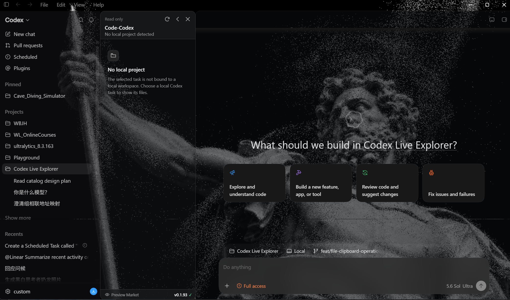

# Code-Codex

English | [简体中文](README.zh-CN.md)

<p align="center">
  
</p>

<p align="center">
  <em>Add a local project file tree, preview tabs, and bounded editing to Codex Desktop.</em>
</p>

<p align="center">
  <a href="https://github.com/Rice-dog/code-codex/releases/tag/v0.1.94"></a>
  <a href="LICENSE"></a>
  
  
  
  
</p>

Code-Codex is an unofficial community project that adds a local project file tree
to Codex Desktop. It demonstrates a local Windows companion app, a bounded
workspace bridge, and an injected TypeScript explorer UI for file preview,
editing, navigation, and file operations.

> [!IMPORTANT]
> Code-Codex is not affiliated with OpenAI.


## Install Option 1: Download EXE

Download the ready-made installer from [`releases`](releases/):

Runtime requirement: Windows 10 version 2004 (build 19041) or newer, x64,
with the official stable Codex/ChatGPT Desktop app installed.

- Recommended: `CodeCodex-0.1.94-x64-setup.exe`
- Alternative: `CodeCodex-0.1.94-x64.msi`
- Portable package: `CodeCodex-0.1.94-x64.zip`
- Standalone uninstaller: `Uninstall-CodeCodex.exe`

You can verify downloads with:

```powershell
Get-FileHash .\CodeCodex-0.1.94-x64-setup.exe -Algorithm SHA256
```

Compare the result with [`SHA256SUMS.txt`](releases/SHA256SUMS.txt).

If the official Codex/ChatGPT Desktop app is installed, the installer checks
for a desktop `Codex` shortcut first and a desktop `ChatGPT` shortcut second.
Only when neither shortcut exists does it create a new managed `Code-Codex`
desktop shortcut.

## Install Option 2: Build EXEs From Source

Requirements:

- Windows 11 x64.
- Rust with the MSVC toolchain.
- Node.js 20.19 or newer.
- Visual Studio Build Tools with Desktop C++.
- .NET SDK if you want to build the MSI package.

Build the release EXE files:

```powershell
./scripts/build.ps1 -Configuration Release
```

The generated EXE files are written to `target/release/`, including:

- `code-codex.exe`
- `code-codex-launcher.exe`
- `Install-CodeCodex.exe`
- `Uninstall-CodeCodex.exe`
- `code-codex-setup.exe`
- `code-codex-shim.exe`
- `code-codex-shortcut.exe`
- `code-codex-uninstall.exe`

Generate the downloadable setup EXE, MSI, and ZIP:

```powershell
./scripts/package.ps1 -Version 0.1.94
```

The generated packages are written to `releases/`.

## Uninstall

Every install path includes a source-built uninstaller program:

- Downloaded setup/ZIP installs place `Uninstall-CodeCodex.exe` under
  `%LOCALAPPDATA%\Programs\Code-Codex`.
- Source builds place `Uninstall-CodeCodex.exe`,
  `Uninstall-CodeCodex.ps1`, and `Finalize-Uninstall.ps1` in `target/release/`.

Run `Uninstall-CodeCodex.exe` to restore the original Codex or ChatGPT shortcut
and remove Code-Codex files. If installation created a standalone `Code-Codex`
desktop shortcut because both official shortcuts were missing, uninstall removes
that shortcut. MSI installs can also be removed from Windows **Installed apps**.

## Features

- File tree in the Codex sidebar for local workspaces.
- Drag files and folders from Windows File Explorer into the workspace root or a file-tree folder.
- Main-window file tabs beside the conversation.
- Text preview and editing, including multilingual Markdown content.
- Independently enabled Markdown, CSV, diagram, image, video, PDF, audio, Jupyter Notebook, Office, and 3D model previews from Preview Market.
- Optional Transparent Background appearance plugin with a reversible Windows compositor surface that reveals content behind Codex while keeping the full Codex window input-active.
- Particle Image Background appearance plugin with a persistent grayscale image library, ordered auto-switching, smooth particle morphing, per-photo framing, and adjustable particle, source, flow, pointer, and render settings.
- Click the version number at the bottom of the file tree to check GitHub for the latest published stable release.
- Codex package versions are diagnostic only; future versions proceed through live protocol and DOM qualification instead of a fixed version allowlist.
- Local CSV table previews with quoted fields, embedded line breaks, sticky headers, and bounded rendering.
- Local, bounded Diagram Preview rendering for `.drawio` files and common `.plantuml` activity syntax without uploading source code.
- Local, read-only Jupyter Notebook previews for Markdown and code cells with saved outputs.
- Local, read-only previews for DOCX documents, XLSX workbooks, and PPT/PPTX presentations.
- Local, interactive glTF 2.0 previews for `.gltf` and `.glb`, including orbit, pan, zoom, fit/reset, a reference grid, and animation playback.
- Context menu actions for create, rename, delete, copy path, reveal, and refresh.
- Drag and drop file movement.
- Local bridge code for bounded workspace operations.

## Preview Plugins


Preview Market is located at the bottom of the Code-Codex file tree. Click it
to open the plugin panel and independently enable previews for Markdown, CSV,
diagrams, images, video, PDF, audio, Jupyter Notebook, Office documents, and
glTF 3D models. Preview processing runs locally on the user's computer.

The 3D Model Preview plugin provides an interactive view for `.gltf` and `.glb`
files with orbit, pan, zoom, fit/reset, reference-grid, and animation controls.



The Particle Image Background appearance plugin transforms locally selected
images into an animated grayscale particle field across Codex. Its image
library supports ordered auto-switching, smooth morphing, per-photo position
and zoom, direct numeric values, and adjustable flow, pointer, source, and
render settings. Transparent Background is available separately. Particle
images and settings remain local to the user's Codex profile.

## Repository Layout

```text
crates/
  cdp-client/          Chrome DevTools Protocol client
  context-resolver/    Codex task/workspace context resolution
  launcher/            Windows launcher and Codex integration logic
  workspace-service/   File listing, preview, mutation, settings, and watcher code

packages/
  explorer-ui/         Injected TypeScript explorer UI

installer/             Windows installer source files
scripts/               Build and packaging helper scripts
releases/              Ready-made downloadable packages
```

## Notes

Generated build folders such as `target/`, `node_modules/`, `dist/`, and
`artifacts/` are intentionally ignored by Git. Standalone test suites and CI
workflows are not included in this public source package.

## License

[MIT](LICENSE).
