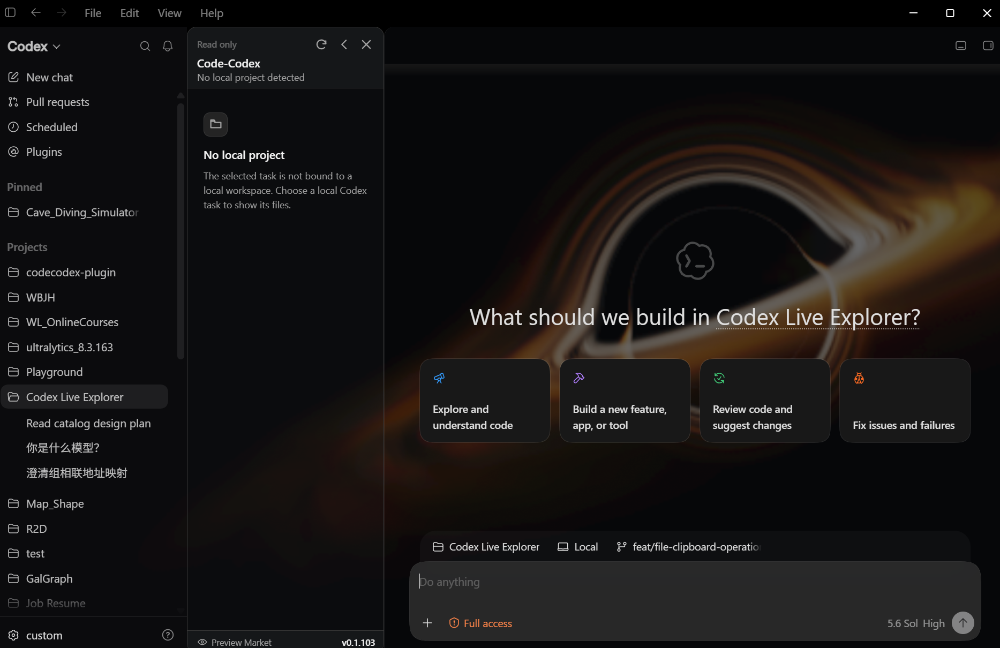
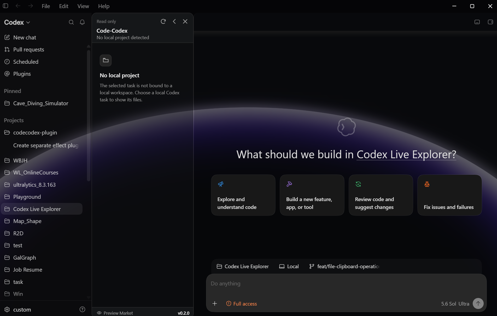
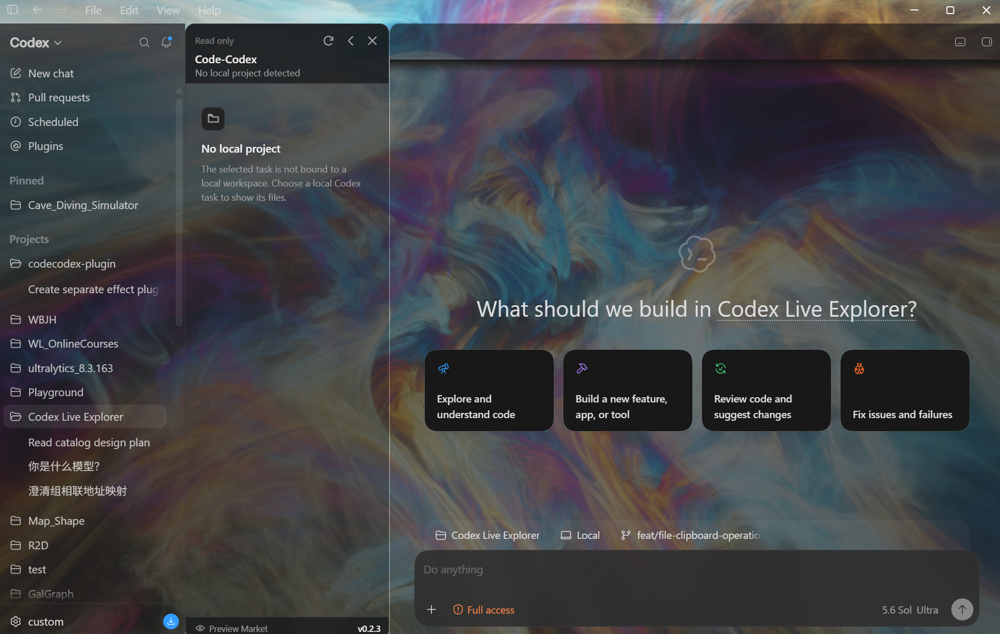
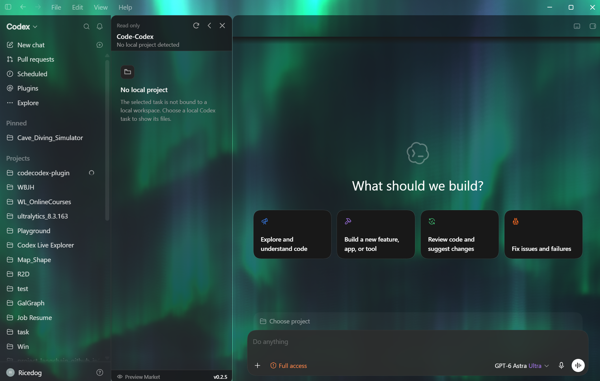
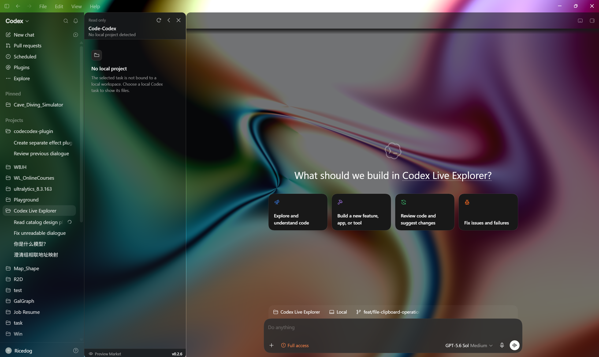
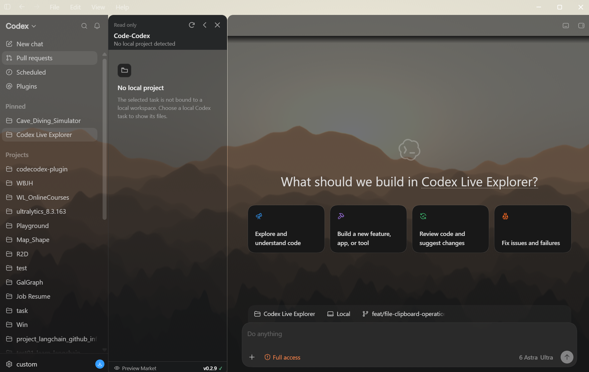
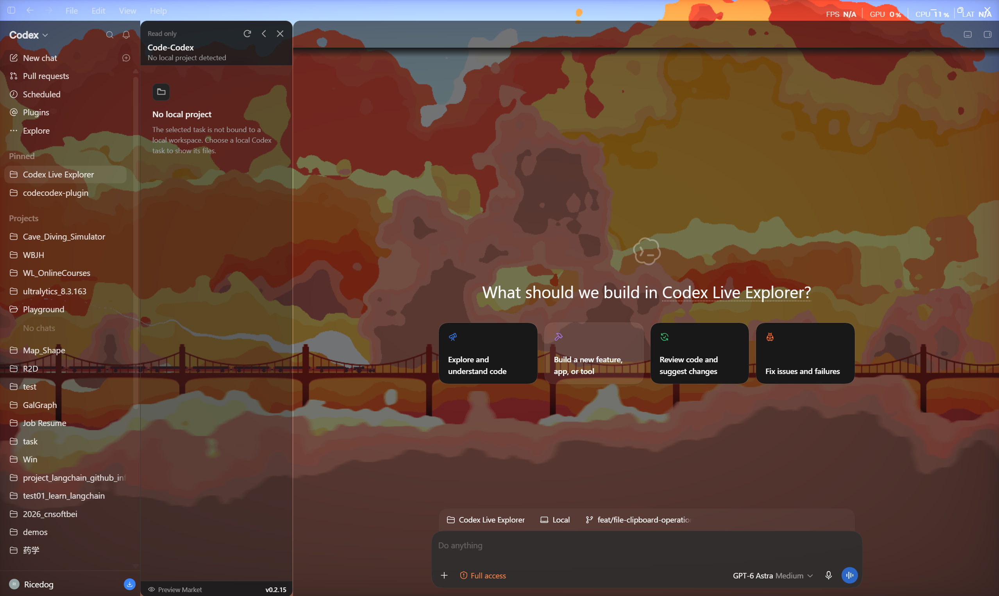
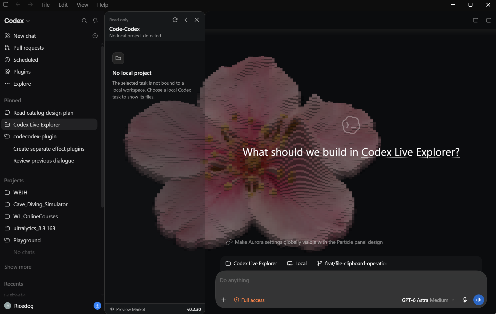

# Code-Codex

简体中文 | [English](README.en.md)

<p align="center">
  
</p>

<p align="center">
  <em>为 Codex Desktop 添加本地项目文件树、预览标签页和受限编辑能力。</em>
</p>

<p align="center">
  <a href="https://github.com/Rice-dog/code-codex/releases/tag/v0.2.59"></a>
  <a href="LICENSE"></a>
  
  
  
  
</p>

Code-Codex 是一个非官方社区项目，用来为 Codex Desktop 增加本地项目文件树。它展示了一个 Windows 本地辅助程序、受限工作区 bridge，以及注入式 TypeScript explorer UI，用于文件预览、编辑、导航和文件操作。

> [!IMPORTANT]
> Code-Codex 与 OpenAI 无关


## 安装方式一：直接下载 EXE

可以从 [`releases`](releases/) 下载已经生成好的安装包：

运行环境要求：Windows 10 版本 2004（build 19041）或更高版本、x64，
并已安装官方稳定版 Codex/ChatGPT Desktop。

- 推荐：`CodeCodex-0.2.59-x64-setup.exe`
- 备选：`CodeCodex-0.2.59-x64.msi`
- 便携包：`CodeCodex-0.2.59-x64.zip`
- 独立卸载程序：`Uninstall-CodeCodex.exe`

可以用下面的命令校验下载文件：

```powershell
Get-FileHash .\CodeCodex-0.2.59-x64-setup.exe -Algorithm SHA256
```

然后和 [`SHA256SUMS.txt`](releases/SHA256SUMS.txt) 中的值对比。

如果已经安装官方 Codex/ChatGPT Desktop，安装器会先检查桌面上的 `Codex` 快捷方式，
再检查 `ChatGPT` 快捷方式。只有这两个官方快捷方式都不存在时，才会创建新的托管
`Code-Codex` 桌面快捷方式。

## 安装方式二：从源码生成 EXE

环境要求：

- Windows 11 x64。
- Rust，并安装 MSVC toolchain。
- Node.js 20.19 或更高版本。
- Visual Studio Build Tools，包含 Desktop C++。
- 如果要生成 MSI，还需要 .NET SDK。

生成 release EXE 文件：

```powershell
./scripts/build.ps1 -Configuration Release
```

生成结果会写入 `target/release/`，包括：

- `code-codex.exe`
- `code-codex-launcher.exe`
- `Install-CodeCodex.exe`
- `Uninstall-CodeCodex.exe`
- `code-codex-setup.exe`
- `code-codex-shim.exe`
- `code-codex-shortcut.exe`
- `code-codex-uninstall.exe`

生成可下载的 setup EXE、MSI 和 ZIP：

```powershell
./scripts/package.ps1 -Version 0.2.59
```

生成结果会写入 `releases/`。

## 卸载

每一种安装方式都会包含由源码构建出的卸载程序：

- 下载安装包或 ZIP 安装后，`Uninstall-CodeCodex.exe` 会位于
  `%LOCALAPPDATA%\Programs\Code-Codex`。
- 从源码构建时，`Uninstall-CodeCodex.exe`、`Uninstall-CodeCodex.ps1` 和
  `Finalize-Uninstall.ps1` 会位于 `target/release/`。

运行 `Uninstall-CodeCodex.exe` 即可恢复原来的 Codex 或 ChatGPT 快捷方式，并移除
Code-Codex 文件。如果安装时因为两个官方快捷方式都缺失而创建了独立的
`Code-Codex` 桌面快捷方式，卸载时会删除这个快捷方式。MSI 安装也可以从 Windows
**已安装的应用** 中卸载。

## 功能

### 核心功能

- Codex 顶部 Help 右侧增加 Code-Codex 菜单，可显示或隐藏文件树、打开预览市场、检查更新并访问项目 GitHub 仓库。
- Codex 侧边栏中的本地工作区文件树。
- 支持从 Windows 文件资源管理器将文件和文件夹复制拖入工作区根目录或文件树中的文件夹。
- 右键菜单支持新建、重命名、删除、复制路径、在资源管理器中显示和刷新。
- 支持在文件树中拖拽移动文件和文件夹。
- 位于对话旁边的主窗口文件标签页。
- 文本预览与编辑，包括多语言 Markdown 内容。
- 本地 bridge 仅执行受限的工作区操作。

### 插件

- Preview Market 分为 Appearance、File Preview 和 Tools 三类，打开时默认显示 Appearance。
- File Preview 可独立启用 Markdown、CSV、图表、图片、视频、PDF、音频、Jupyter Notebook、Office 和 3D 模型预览；所有处理都在本地完成。
- Appearance 包含透明背景、粒子图像、黑洞、发光地平线、天境云隧道、极光电离层、银河光场、层叠山峦、云海列车和立体像素浮雕等背景插件。
- Tools 中的 Git History 以只读方式显示当前分支、提交记录、变更文件和带颜色的逐文件 diff，不执行仓库写入操作。

### 更新与兼容

- 点击文件树底部的版本号，或在 Code-Codex 菜单中选择 **Check for Updates…**，可通过 GitHub 检查最新发布的稳定版本。
- 启动失败时显示具体失败阶段、稳定支持代码和处理建议，并可复制或打开本地脱敏诊断报告。
- Codex 软件包版本仅作为诊断信息；未来版本不再受固定版本白名单限制，而是通过实时协议和 DOM 结构检查。

## Preview Market 插件

“预览市场”入口位于 Code-Codex 文件树底部。插件面板按 **Appearance**、**File Preview**
和 **Tools** 分类显示，打开时默认进入 Appearance；选择分类后只显示该分类的插件。

### 文件预览插件


File Preview 分类可按需独立启用 Markdown、CSV、图表、图片、视频、PDF、音频、Jupyter
Notebook、Office 文档和 glTF 3D 模型预览，所有预览处理都在用户电脑本地完成。

3D 模型预览插件为 `.gltf` 和 `.glb` 文件提供交互式视图，支持旋转、平移、缩放、
适配/重置视图、参考网格和动画控制。

### 外观插件


“粒子图像背景”外观插件可将本地选择的图片转换为覆盖 Codex 的动态灰度粒子场。图片库支持
按顺序自动切换、流畅变形、逐图位置与缩放、直接输入数值，以及可调的流动、指针、Source
和渲染参数。“透明背景”作为另一个独立的外观插件提供。粒子图片及设置仅保存在用户本机的
Codex 配置中。



“黑洞背景”外观插件复用同一套全窗口背景表面，并提供可调的光线步进黑洞、时间累积和辉光效果。
渲染质量参数已固定在程序内部并对用户隐藏，以保证一致的使用体验。启用时会将 Codex 的真实外观设置自动切换为深色；停用时会恢复用户之前的外观设置。



“发光地平线背景”外观插件可在整个 Codex 窗口中显示交互式发光地平线，支持上、下、左、右
四个方向，以及滚轮变形、惯性与回弹、开场动画和辉光颜色调节。设置面板支持中文与英文切换。
启用插件时会自动将 Codex 切换为深色外观，停用时会恢复此前的外观设置。



“天境云隧道背景”外观插件可在整个 Codex 窗口中显示无需纹理的实时光线步进云隧道，支持调节
前进速度、光雾密度、湍流强度、隧道半径、光谱偏移、指针引导、开场动画和三档渲染质量。
设置面板支持中文与英文切换，并复用其他 GPU 背景插件的自动深色外观与停用恢复机制。



“极光电离层背景”外观插件可在整个 Codex 窗口中显示运行时生成的体积极光光幕和程序化星空。
插件保留原效果的三阶段 WebGL 渲染、自适应质量和电影式揭示，并在中英文二级设置面板中提供
电离层场、开场顺序、渲染质量和动画状态等参数。



Milky Way Background 外观插件可在整个 Codex 窗口中显示五色谐波光场。中英文二级设置面板
支持分别调节五种颜色，以及流动速度、波动幅度、频率、缩放、旋转、亮度和开场动画。
插件采用单阶段 WebGL 渲染，隐藏时暂停绘制，支持暂停、重播和减少动态效果。
启用时自动切换为 Codex 深色外观，停用时恢复此前设置。所提供的效果项目根据
Almina（@Code4_11）的“Milky way”部分参考片段重建。



Layered Mountain Background 在整个 Codex 窗口中呈现动态层叠山峦、暖色逆光和雾气，提供反向漂移、山体形态、曝光、渲染比例、质量、暂停与重置等中英文控制；约 3 秒的柔和开场会由远及近显现山峦，支持重播并在减少动态效果模式下跳过；插件采用双阶段 WebGL 2 渲染和紧凑山脊图集，启用时自动切换深色外观，停用时恢复此前设置。



Cloud Train Background 在整个 Codex 窗口中呈现云海、蒸汽列车与桥梁，右侧中英文设置面板可调节行进速度、缩放、云层细节、拖影、色相、色温及天空／烟雾／列车染色，并支持暂停和重置；开场动画会按景深从远到近在原位逐层淡入，可调整开关、时长（0.5～10 秒）和羽化宽度并支持重播，默认 3 秒且在减少动态效果模式下跳过；启用插件时沿用原生深色外观，停用时恢复此前设置。

#### Pixel Sculpt Background



在 Preview Market 中启用，将图片转换为可交互的立体像素浮雕背景。右侧中英文二级面板可调整像素形状、浮雕深度、鼠标波纹、颜色、位置和旋转；支持本地图片库、排序与自动变形切换。启用时切换原生深色外观，停用后恢复之前的设置。

### 工具插件

Git History 位于 Tools 分类中，以只读方式显示当前分支和提交记录。进入提交节点后可查看变更文件，
点击文件名会在主对话区域打开带绿色新增、红色删除和紫色区块定位信息的 diff 标签页。

## 仓库结构

```text
crates/
  cdp-client/          Chrome DevTools Protocol 客户端
  context-resolver/    Codex task / workspace 上下文解析
  launcher/            Windows 启动器和 Codex 集成逻辑
  workspace-service/   文件列表、预览、修改、设置和 watcher 代码

packages/
  explorer-ui/         注入式 TypeScript explorer UI

installer/             Windows 安装器源码文件
scripts/               构建和打包辅助脚本
releases/              已生成的可下载安装包
```

## 说明

`target/`、`node_modules/`、`dist/`、`artifacts/` 等生成目录会被 Git 忽略。这个公开源码包不包含独立测试套件和 CI workflow。

## 许可证

[MIT](LICENSE)。第三方效果的来源、修改内容和许可证边界见[第三方声明](THIRD_PARTY_NOTICES_ZH_CN.md)。
