# Code-Codex

简体中文 | [English](README.en.md)

<p align="center">
  
</p>

<p align="center">
  <em>为 Codex Desktop 添加本地项目文件树、预览标签页和受限编辑能力。</em>
</p>

<p align="center">
  <a href="https://github.com/Rice-dog/code-codex/releases"></a>
  <a href="LICENSE"></a>
  
  
  
  
</p>

Code-Codex 是一个非官方社区项目，用来为 Codex Desktop 增加本地项目文件树。它展示了一个 Windows 本地辅助程序、受限工作区 bridge，以及注入式 TypeScript explorer UI，用于文件预览、编辑、导航和文件操作。

> [!IMPORTANT]
> Code-Codex 与 OpenAI 无关

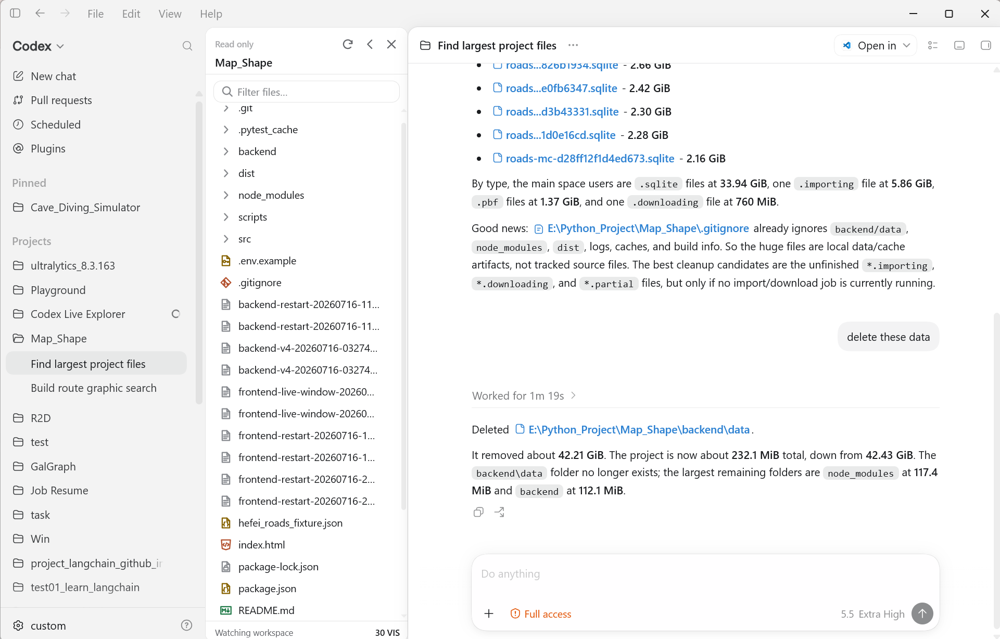

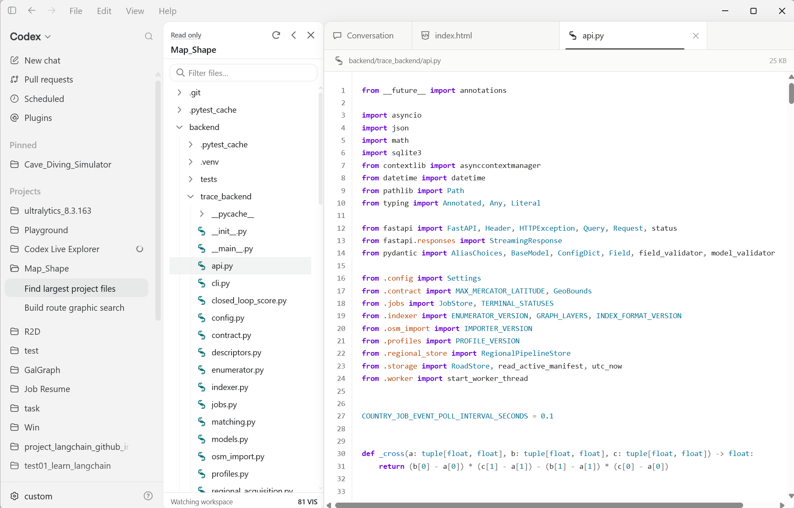

版本 **0.4.0**：插件市场完整显示插件名称，下载大小和状态放在按钮上方，下载时显示进度，验证完成后即可启用。Enable 使用浅蓝色，Download 使用浅紫色；支持单项下载、取消与重试。24 个插件继续复用已发布的 v0.3.96 资源，升级保留已有缓存和参数。

## 安装方式一：直接下载 EXE

可以从 [`releases`](releases/) 下载已经生成好的安装包：

运行环境要求：Windows 10 版本 2004（build 19041）或更高版本、x64，
并已安装官方稳定版 Codex/ChatGPT Desktop。

- 推荐：`CodeCodex-0.4.0-x64-setup.exe`
- 备选：`CodeCodex-0.4.0-x64.msi`
- 便携包：`CodeCodex-0.4.0-x64.zip`
- 独立卸载程序：`Uninstall-CodeCodex.exe`

可以用下面的命令校验下载文件：

```powershell
Get-FileHash .\CodeCodex-0.4.0-x64-setup.exe -Algorithm SHA256
```

然后和 [`SHA256SUMS.txt`](releases/SHA256SUMS.txt) 中的值对比。

如果已经安装官方 Codex Desktop，安装器会检查当前用户和公共桌面的快捷方式：
优先使用指向官方 Codex 的快捷方式，也可接管用户创建的 `Codex`、`ChatGPT`
快捷方式，或指向 `Codex.exe` / `ChatGPT.exe` 的重命名快捷方式。原快捷方式会备份，
卸载时恢复；只有找不到这些快捷方式时，才会创建独立的 `Code-Codex` 桌面快捷方式。
安装完成后，安装器会显示实际使用的快捷方式路径。

## 安装方式二：从源码生成 EXE

环境要求：

- Windows 11 x64。
- Rust，并安装 MSVC toolchain。
- Node.js 20.19 或更高版本。
- Visual Studio Build Tools，包含 Desktop C++。
- 如果要生成 MSI，还需要 .NET SDK。

生成 release EXE 文件：

```powershell
./scripts/build.ps1 -Configuration Release
```

生成结果会写入 `target/release/`，包括：

- `code-codex.exe`
- `code-codex-launcher.exe`
- `Install-CodeCodex.exe`
- `Uninstall-CodeCodex.exe`
- `code-codex-setup.exe`
- `code-codex-shim.exe`
- `code-codex-shortcut.exe`
- `code-codex-uninstall.exe`

生成可下载的 setup EXE、MSI 和 ZIP：

```powershell
./scripts/package.ps1 -Version 0.4.0
```

生成结果会写入 `releases/`。

## 所有插件按需下载

从 **0.3.96** 开始，Preview Market 中的 **24 个插件全部独立下载**：Appearance 13 个、File Preview 10 个、Tools 1 个。核心安装包保留文件树、基础文本预览与编辑、市场和设置框架、权限检查与运行日志；插件的实际渲染、预览、启动播放器和工具实现不再内置。

打开 Preview Market，先点击 **Download**；下载和校验完成后点击 **Enable**，即可在当前 Codex 窗口使用，无需重启。下载不会自动启用插件或打开设置。参数按钮在完整插件包可用后使用；UI Surface Opacity 仍要求先实际启用一个背景插件。

插件代码与必需资源来自本项目 GitHub Release。下载、缓存和每次载入都根据核心内置目录核对文件大小与 SHA-256；不能通过市场安装任意第三方脚本。插件目录按三类归档：

```text
releases/plugins/
├── appearance/
│   └── particle-image/       # 插件主 JS、manifest、说明及默认图片
├── file-preview/
│   └── office-preview/       # 预览代码及本地 Worker/WASM 等资源
└── developer-tools/
    └── git-history/          # 只读 Git 工具实现
```

每个插件的文件夹名称使用稳定英文 ID，代码、样式和必需资源留在该插件目录内。GitHub Release 资产仍使用唯一文件名；`releases/release-assets.json` 映射文件名、本地分类路径和 SHA-256。

缓存位于 `%LOCALAPPDATA%\CodeCodex\plugin-cache\plugins\<类别>\<插件ID>\<插件版本>`。正常升级和普通卸载保留缓存，未变插件可离线复用；旧的有效分类前目录或平铺缓存先校验再迁移。原有参数、启用偏好、个人图库和用户视频保留。Installed 仅表示缓存完整；当前窗口尚未校验载入时，按钮显示 Enable，保存偏好不会因此被清空。此前内置的预览、工具及三种外观功能首次使用新独立包时需要下载；已有背景只在所需包或素材变化、缺失或损坏时重新下载。

Particle Image 默认提供 **6 张原图**，Pixel Sculpt 默认提供 **3 张原图**，随对应背景插件下载。首次使用自动导入，已有相同图片不重复添加，个人图片和播放选择保留；用户删除默认图片后，重新打开不会自动恢复。这些图片没有加入核心安装包。

Codex Startup Transition 的播放器也需下载。核心只保留很小的早期加载入口，在官方等待画面读取已校验的启动插件和所选背景缓存，不联网、不等待文件树挂载。缺包或损坏时跳过动画并记录原因，Codex 正常继续启动。视频仍来自用户本地 IndexedDB，安装包和插件包不自带官方宣传视频。

离线安装保留上述目录及插件的全部资源，再运行该版本 `code-codex.exe plugins --import-dir "releases目录"`；也可指定 `plugins`、分类目录或单个插件目录。命令仅导入内置目录信任的完整资产，不自动启用插件。当前没有独立插件更新或卸载管理页。

README 的 `docs/screenshots/` 功能说明截图继续保留在 GitHub，不再随 EXE、MSI 或 ZIP 分发；它们与插件默认图库素材不同。查看完整截图可访问仓库 README。安装器不会自动预下载所有插件，本地生成的包须发布匹配的 GitHub 资产后，其他用户的 Download 才可用。

## 卸载

每一种安装方式都会包含由源码构建出的卸载程序：

- 下载安装包或 ZIP 安装后，`Uninstall-CodeCodex.exe` 会位于
  `%LOCALAPPDATA%\Programs\Code-Codex`。
- 从源码构建时，`Uninstall-CodeCodex.exe`、`Uninstall-CodeCodex.ps1` 和
  `Finalize-Uninstall.ps1` 会位于 `target/release/`。

运行 `Uninstall-CodeCodex.exe` 即可恢复安装前的桌面快捷方式，并移除
Code-Codex 文件。如果安装时没有可接管的快捷方式而创建了独立的
`Code-Codex` 桌面快捷方式，卸载时会删除这个快捷方式。MSI 安装也可以从 Windows
**已安装的应用** 中卸载。

## 功能

### 核心功能

- Codex 顶部 Help 右侧增加 Code-Codex 菜单，可显示或隐藏文件树、打开预览市场、检查更新并访问项目 GitHub 仓库。
- Codex 侧边栏中的本地工作区文件树。
- 支持从 Windows 文件资源管理器将文件和文件夹复制拖入工作区根目录或文件树中的文件夹。
- 右键菜单支持新建、重命名、删除、复制路径、在资源管理器中显示和刷新。
- 支持在文件树中拖拽移动文件和文件夹。
- 位于对话旁边的主窗口文件标签页。
- 基础文本预览、语法高亮与受限编辑；Markdown 渲染由独立预览插件提供。
- 本地 bridge 仅执行受限的工作区操作。

### 插件

- Preview Market 分为 Appearance、File Preview 和 Tools 三类，打开时默认显示 Appearance。
- File Preview 可独立下载并启用 Markdown、CSV、图表、图片、视频、PDF、音频、Jupyter Notebook、Office 和 3D 模型预览；所有处理都在本地完成。
- Appearance 包含十种动态背景、Transparent Background、UI Surface Opacity 和 Codex Startup Transition，均先下载再启用。
- Tools 中的 Git History 下载启用后，以只读方式显示当前分支、提交记录、变更文件和带颜色的逐文件 diff，不执行仓库写入操作。

### 更新与兼容

- 点击文件树底部的版本号，或在 Code-Codex 菜单中选择 **Check for Updates…**，可通过 GitHub 检查最新发布的稳定版本。
- Codex Startup Transition 可选择视频或全部十种动态背景作为启动动画，包括使用本地图片库的 Particle Image 和 Pixel Sculpt；背景至少展示四秒，准备就绪后按设定时间淡出。
- 启动失败时显示具体失败阶段、稳定支持代码和处理建议，并可复制或打开本地脱敏诊断报告。
- Codex 软件包版本仅作为诊断信息；未来版本不再受固定版本白名单限制，而是通过实时协议和 DOM 结构检查。

## Preview Market 插件

“预览市场”入口位于 Code-Codex 文件树底部。插件面板按 **Appearance**、**File Preview**
和 **Tools** 分类显示，打开时默认进入 Appearance；选择分类后只显示该分类的插件。

### 文件预览插件

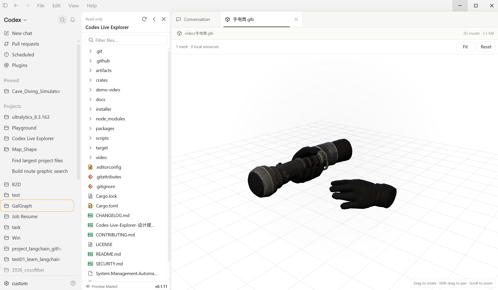

File Preview 分类可按需独立下载并启用 Markdown、CSV、图表、图片、视频、PDF、音频、Jupyter
Notebook、Office 文档和 glTF 3D 模型预览，所有预览处理都在用户电脑本地完成。

3D 模型预览插件为 `.gltf` 和 `.glb` 文件提供交互式视图，支持旋转、平移、缩放、
适配/重置视图、参考网格和动画控制。

### 外观插件

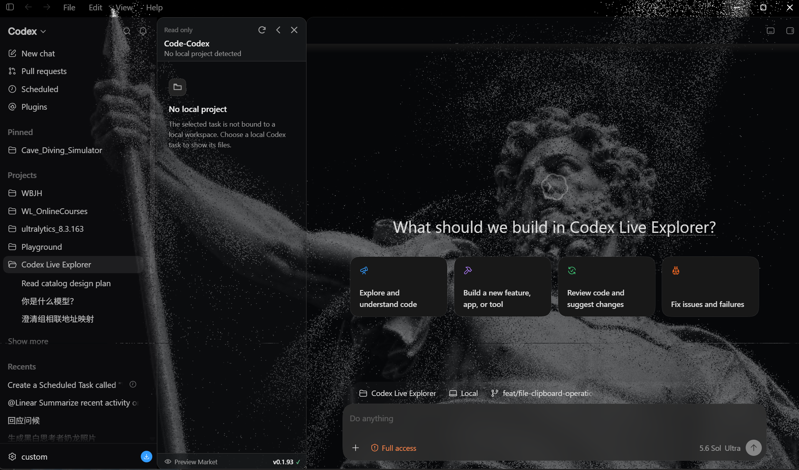

“粒子图像背景”外观插件可将本地选择的图片转换为覆盖 Codex 的动态灰度粒子场。图片库支持
按顺序自动切换、流畅变形、逐图位置与缩放、直接输入数值，以及可调的流动、指针、Source
和渲染参数。“透明背景”作为另一个独立的外观插件提供。粒子图片及设置仅保存在用户本机的
Codex 配置中。粒子汇聚开场支持开关、时长、汇聚范围与独立重播；启动遮罩结束后才重播主页背景的开场。

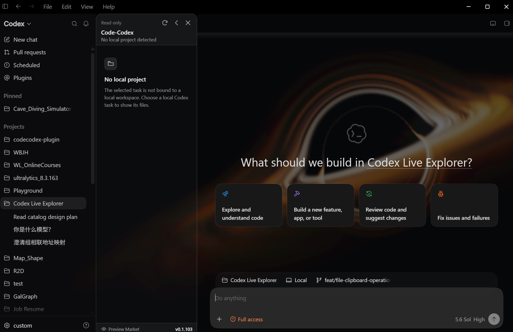

“黑洞背景”外观插件复用同一套全窗口背景表面，并提供可调的光线步进黑洞、时间累积和辉光效果。
渲染质量参数已固定在程序内部并对用户隐藏，以保证一致的使用体验。启用时会将 Codex 的真实外观设置自动切换为深色；停用时会恢复用户之前的外观设置。

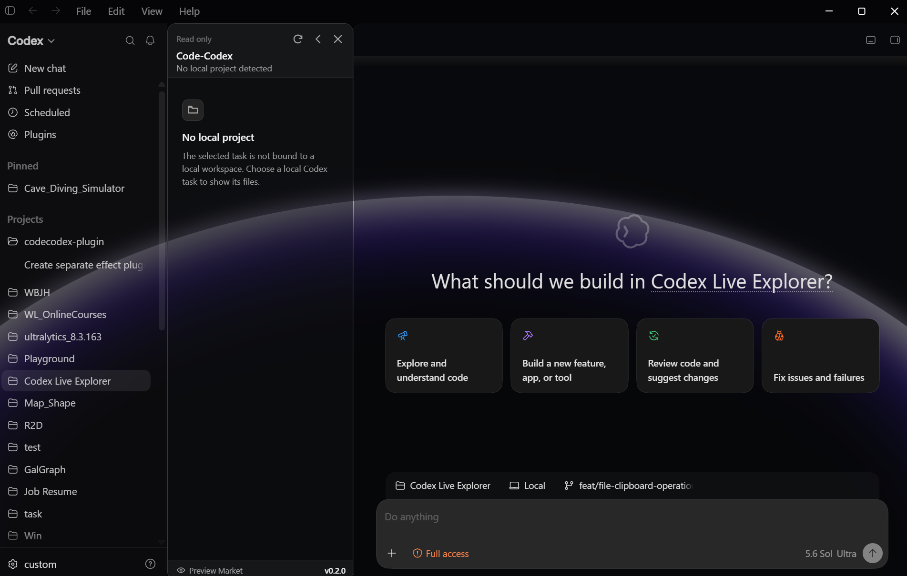

“发光地平线背景”外观插件可在整个 Codex 窗口中显示交互式发光地平线，支持上、下、左、右
四个方向，以及滚轮变形、惯性与回弹、开场动画和辉光颜色调节。设置面板支持中文与英文切换。
启用插件时会自动将 Codex 切换为深色外观，停用时会恢复此前的外观设置。

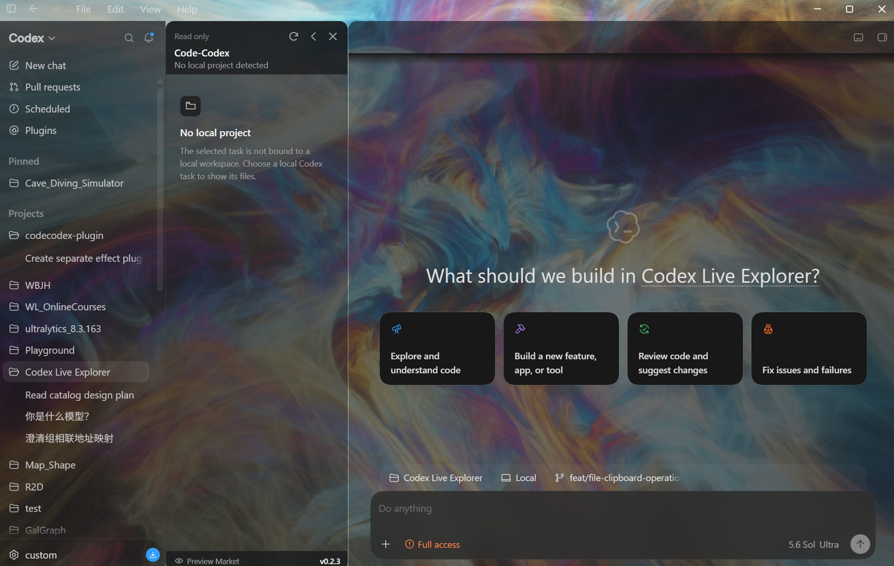

“天境云隧道背景”外观插件可在整个 Codex 窗口中显示无需纹理的实时光线步进云隧道，支持调节
前进速度、光雾密度、湍流强度、隧道半径、光谱偏移、指针引导、开场动画和三档渲染质量。
设置面板支持中文与英文切换，并复用其他 GPU 背景插件的自动深色外观与停用恢复机制。

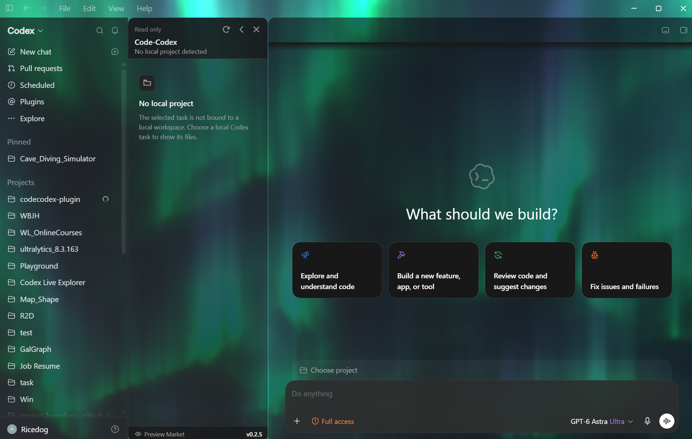

“极光电离层背景”外观插件可在整个 Codex 窗口中显示运行时生成的体积极光光幕和程序化星空。
插件保留原效果的三阶段 WebGL 渲染、自适应质量和电影式揭示，并在中英文二级设置面板中提供
电离层场、开场顺序、渲染质量和动画状态等参数。

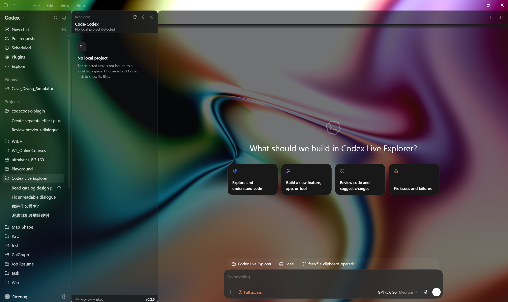

Milky Way Background 外观插件可在整个 Codex 窗口中显示五色谐波光场。中英文二级设置面板
支持分别调节五种颜色，以及流动速度、波动幅度、频率、缩放、旋转、亮度和开场动画。
插件采用单阶段 WebGL 渲染，隐藏时暂停绘制，支持暂停、重播和减少动态效果。
启用时自动切换为 Codex 深色外观，停用时恢复此前设置。所提供的效果项目根据
Almina（@Code4_11）的“Milky way”部分参考片段重建。

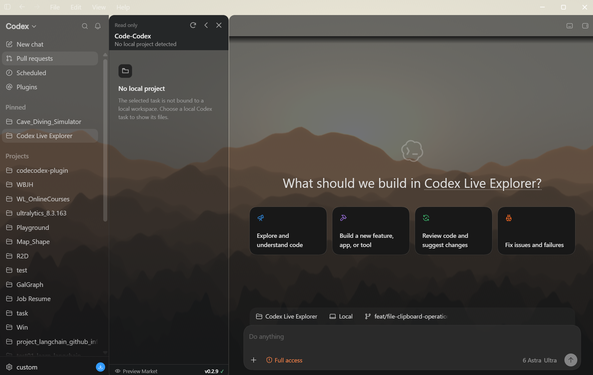

Layered Mountain Background 在整个 Codex 窗口中呈现动态层叠山峦、暖色逆光和雾气，提供反向漂移、山体形态、曝光、渲染比例、质量、暂停与重置等中英文控制；约 3 秒的柔和开场会由远及近显现山峦，支持重播并在减少动态效果模式下跳过；插件采用双阶段 WebGL 2 渲染和紧凑山脊图集，启用时自动切换深色外观，停用时恢复此前设置。

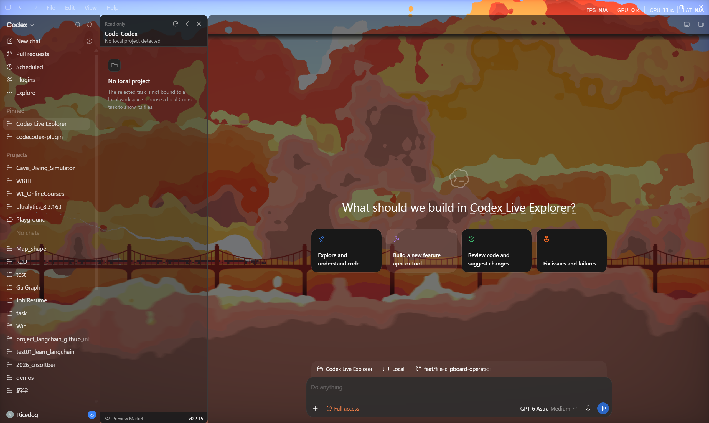

Cloud Train Background 在整个 Codex 窗口中呈现云海、蒸汽列车与桥梁，右侧中英文设置面板可调节行进速度、缩放、云层细节、拖影、色相、色温及天空／烟雾／列车染色，并支持暂停和重置；开场动画会按景深从远到近在原位逐层淡入，可调整开关、时长（0.5～10 秒）和羽化宽度并支持重播，默认 3 秒且在减少动态效果模式下跳过；启用插件时沿用原生深色外观，停用时恢复此前设置。

#### Pixel Sculpt Background

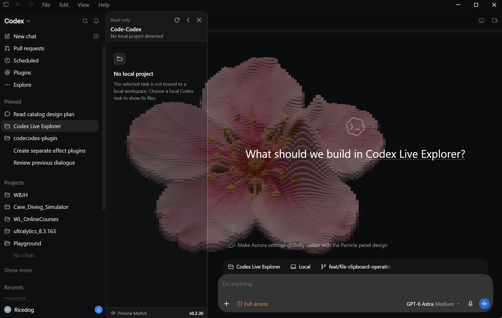

在 Preview Market 中启用，将图片转换为可交互的立体像素浮雕背景。右侧中英文二级面板可调整像素形状、浮雕深度、鼠标波纹、颜色、位置和旋转；支持本地图片库、排序与自动变形切换。启用时切换原生深色外观，停用后恢复之前的设置。

#### Blinking Squares Background

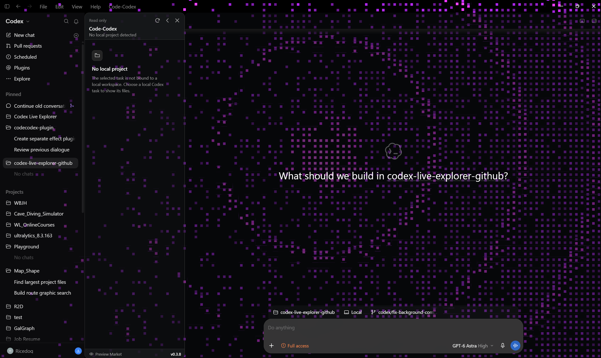

Blinking Squares Background 在整个 Codex 窗口中显示从选定边缘逐渐变密的独立闪烁方块。中英文设置面板可调节方向、密度、闪烁、颜色、鼠标余迹、点击脉冲、键盘随机波纹的数量上限与满额冷却时间、开场动画及画质；支持暂停和重播。启用时自动切换深色外观，停用后恢复之前的设置。

### 工具插件

Git History 位于 Tools 分类中，以只读方式显示当前分支和提交记录。进入提交节点后可查看变更文件，
点击文件名会在主对话区域打开带绿色新增、红色删除和紫色区块定位信息的 diff 标签页。

## 仓库结构

```text
crates/
  cdp-client/          Chrome DevTools Protocol 客户端
  context-resolver/    Codex task / workspace 上下文解析
  launcher/            Windows 启动器和 Codex 集成逻辑
  workspace-service/   文件列表、预览、修改、设置和 watcher 代码

packages/
  explorer-ui/         注入式 TypeScript explorer UI

installer/             Windows 安装器源码文件
scripts/               构建和打包辅助脚本
releases/              已生成的可下载安装包
```

## 说明

`target/`、`node_modules/`、`dist/`、`artifacts/` 等生成目录会被 Git 忽略。这个公开源码包不包含独立测试套件和 CI workflow。

## 许可证

[MIT](LICENSE)。第三方效果的来源、修改内容和许可证边界见[第三方声明](THIRD_PARTY_NOTICES_ZH_CN.md)。
