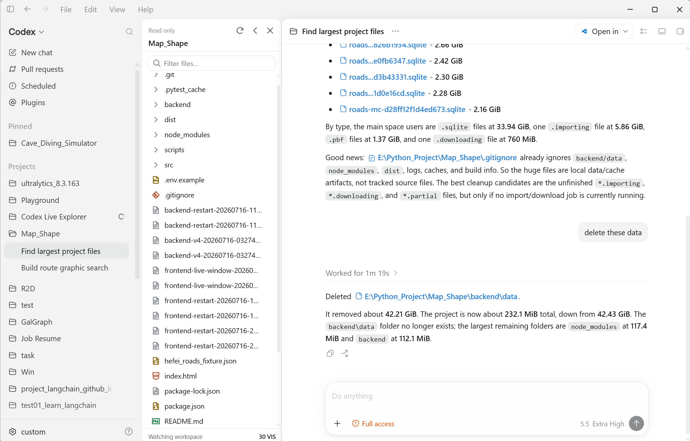
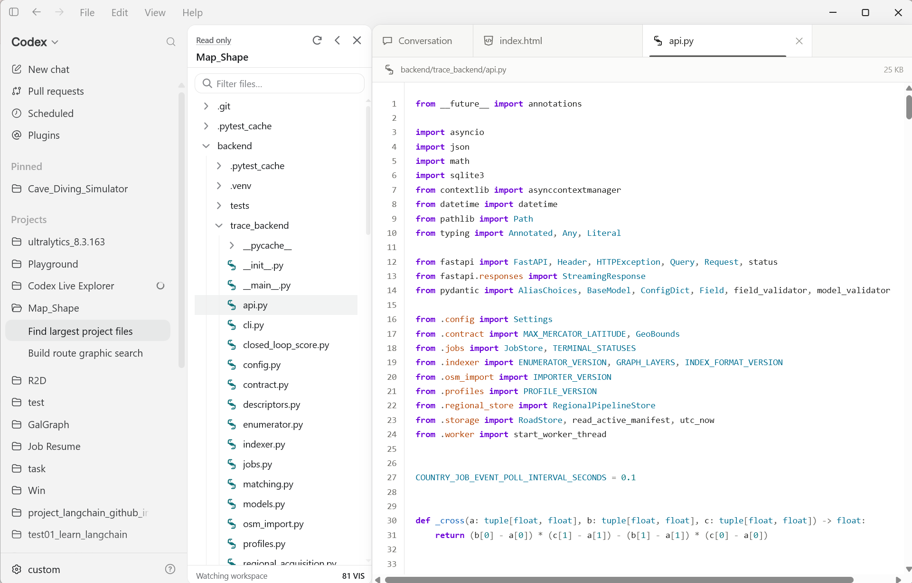
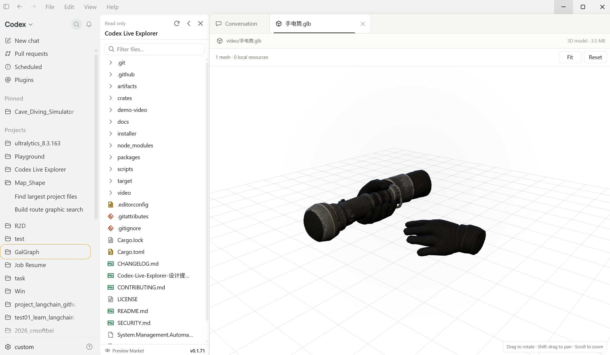

# Code-Codex

[English](README.md) | 简体中文

<p align="center">
  
</p>

<p align="center">
  <em>为 Codex Desktop 添加本地项目文件树、预览标签页和受限编辑能力。</em>
</p>

<p align="center">
  <a href="https://github.com/Rice-dog/code-codex/releases/tag/v0.1.87"></a>
  <a href="LICENSE"></a>
  
  
  
  
</p>

Code-Codex 是一个非官方社区项目，用来为 Codex Desktop 增加本地项目文件树。它展示了一个 Windows 本地辅助程序、受限工作区 bridge，以及注入式 TypeScript explorer UI，用于文件预览、编辑、导航和文件操作。

> [!IMPORTANT]
> Code-Codex 与 OpenAI 无关





## 安装方式一：直接下载 EXE

可以从 [`releases`](releases/) 下载已经生成好的安装包：

运行环境要求：Windows 10 版本 2004（build 19041）或更高版本、x64，
并已安装官方稳定版 Codex/ChatGPT Desktop。

- 推荐：`CodeCodex-0.1.87-x64-setup.exe`
- 备选：`CodeCodex-0.1.87-x64.msi`
- 便携包：`CodeCodex-0.1.87-x64.zip`
- 独立卸载程序：`Uninstall-CodeCodex.exe`

可以用下面的命令校验下载文件：

```powershell
Get-FileHash .\CodeCodex-0.1.87-x64-setup.exe -Algorithm SHA256
```

然后和 [`SHA256SUMS.txt`](releases/SHA256SUMS.txt) 中的值对比。

如果已经安装官方 Codex/ChatGPT Desktop，安装器会先检查桌面上的 `Codex` 快捷方式，
再检查 `ChatGPT` 快捷方式。只有这两个官方快捷方式都不存在时，才会创建新的托管
`Code-Codex` 桌面快捷方式。

## 安装方式二：从源码生成 EXE

环境要求：

- Windows 11 x64。
- Rust，并安装 MSVC toolchain。
- Node.js 20.19 或更高版本。
- Visual Studio Build Tools，包含 Desktop C++。
- 如果要生成 MSI，还需要 .NET SDK。

生成 release EXE 文件：

```powershell
./scripts/build.ps1 -Configuration Release
```

生成结果会写入 `target/release/`，包括：

- `code-codex.exe`
- `code-codex-launcher.exe`
- `Install-CodeCodex.exe`
- `Uninstall-CodeCodex.exe`
- `code-codex-setup.exe`
- `code-codex-shim.exe`
- `code-codex-shortcut.exe`
- `code-codex-uninstall.exe`

生成可下载的 setup EXE、MSI 和 ZIP：

```powershell
./scripts/package.ps1 -Version 0.1.87
```

生成结果会写入 `releases/`。

## 卸载

每一种安装方式都会包含由源码构建出的卸载程序：

- 下载安装包或 ZIP 安装后，`Uninstall-CodeCodex.exe` 会位于
  `%LOCALAPPDATA%\Programs\Code-Codex`。
- 从源码构建时，`Uninstall-CodeCodex.exe`、`Uninstall-CodeCodex.ps1` 和
  `Finalize-Uninstall.ps1` 会位于 `target/release/`。

运行 `Uninstall-CodeCodex.exe` 即可恢复原来的 Codex 或 ChatGPT 快捷方式，并移除
Code-Codex 文件。如果安装时因为两个官方快捷方式都缺失而创建了独立的
`Code-Codex` 桌面快捷方式，卸载时会删除这个快捷方式。MSI 安装也可以从 Windows
**已安装的应用** 中卸载。

## 功能

- Codex 侧边栏中的本地工作区文件树。
- 支持从 Windows 文件资源管理器将文件和文件夹复制拖入工作区根目录或文件树中的文件夹。
- 位于对话旁边的主窗口文件标签页。
- 文本预览与编辑，包括多语言 Markdown 内容。
- 可在预览市场中独立启用 Markdown、CSV、图表、图片、视频、PDF、音频、Jupyter Notebook、Office 和 3D 模型预览。
- 可选的“透明背景”外观插件，通过可恢复的 Windows 合成器透明表面显示 Codex 后方内容，同时保持整个 Codex 窗口接收输入，避免点击穿透到后方应用。
- “粒子图像背景”外观插件提供持久化的灰度图片库、按顺序自动切换和流畅的粒子变形；用户界面仅开放粒子数量与 Source 参数。
- Codex 软件包版本仅作为诊断信息；未来版本不再受固定版本白名单限制，而是通过实时协议和 DOM 结构检查。
- 在本地以表格形式预览 CSV，支持引号字段、字段内换行、固定表头和受限渲染。
- 在本地以受限方式预览 `.drawio` 文件和常用 `.plantuml` 活动图语法，不会上传源代码。
- 在本地以只读方式预览 Jupyter Notebook 的 Markdown、代码单元格和已保存输出。
- 在本地以只读方式预览 DOCX 文档、XLSX 工作簿和 PPT/PPTX 演示文稿。
- 在本地交互式预览 glTF 2.0 `.gltf` 和 `.glb` 模型，支持旋转、平移、缩放、适配/重置视图、参考网格和动画播放。
- 右键菜单：新建、重命名、删除、复制路径、在资源管理器中显示、刷新。
- 文件和文件夹拖拽移动。
- 用于受限工作区操作的本地 bridge 代码。

## 预览插件



“预览市场”入口位于 Code-Codex 文件树底部。点击该入口即可打开插件面板，并按需独立启用
Markdown、CSV、图表、图片、视频、PDF、音频、Jupyter Notebook、Office 文档和 glTF 3D
模型预览插件。预览处理在用户电脑本地完成。

3D 模型预览插件为 `.gltf` 和 `.glb` 文件提供交互式视图，支持旋转、平移、缩放、
适配/重置视图、参考网格和动画控制。“透明背景”和“粒子图像背景”作为独立的外观插件提供。
粒子图片及设置仅保存在用户本机的 Codex 配置中。

## 仓库结构

```text
crates/
  cdp-client/          Chrome DevTools Protocol 客户端
  context-resolver/    Codex task / workspace 上下文解析
  launcher/            Windows 启动器和 Codex 集成逻辑
  workspace-service/   文件列表、预览、修改、设置和 watcher 代码

packages/
  explorer-ui/         注入式 TypeScript explorer UI

installer/             Windows 安装器源码文件
scripts/               构建和打包辅助脚本
releases/              已生成的可下载安装包
```

## 说明

`target/`、`node_modules/`、`dist/`、`artifacts/` 等生成目录会被 Git 忽略。这个公开源码包不包含独立测试套件和 CI workflow。

## 许可证

[MIT](LICENSE)。
