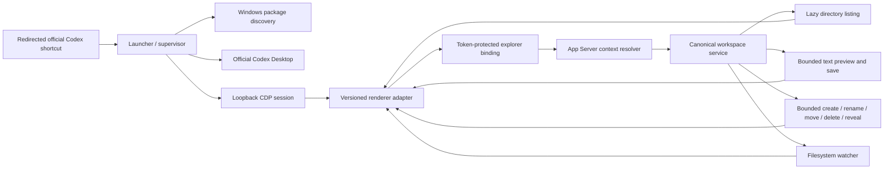

# Architecture

Code-Codex adds a project tree, bounded item actions, and bounded text
preview/editing to a Codex Desktop renderer without changing the installed package. A
companion launcher owns every native resource for the complete debug-enabled
Codex lifetime and exits after Codex closes.

## Process lifecycle

1. Discover the requested package with Windows package APIs and require an exact
   version from the verified compatibility allowlist.
2. Refuse to attach to an already-running non-debug Codex instance.
3. Reserve a random loopback port and launch the package entry with Chromium
   remote-debugging arguments.
4. Poll `/json/list`, require exactly one qualified Codex main renderer, and bind
   injection to its top frame and `app://-/index.html` document lifetime.
5. The renderer adapter emits the selected thread ID. A dedicated App Server
   stdio client resolves that thread's `cwd` using `thread/read`.
6. Native code canonicalizes and binds the root, replaces the old watcher, and
   serves only allowlisted relative-path operations. File selection may request
   a fixed-policy text preview, an eligible complete preview may be saved, and
   the context menu may create, rename, delete, or reveal a validated item, and
   internal drag-and-drop may move an item to a validated workspace folder. No
   general file reader, writer, import, or command API is exposed.
7. Same-origin top-frame reload triggers idempotent reinjection. Navigation away
   revokes the session. Codex or launcher exit stops the watcher, closes CDP,
   terminates the debug-enabled process job, and exits Code-Codex.

## Crate responsibilities

- `launcher`: CLI, package/process lifecycle, diagnostics, and orchestration.
- `cdp-client`: target discovery, JSON-RPC multiplexing, binding events, and
  reinjection.
- `context-resolver`: App Server stdio protocol and thread-to-workspace mapping.
- `workspace-service`: path policy, lazy enumeration, bounded preview/save and
  item actions, ignore rules, settings, watcher events, and resource limits.

The renderer bundle is built before Rust and embedded in the executable. No HTTP
file service is opened, and absolute roots never need to enter the renderer.

## Preview and save data flow

1. A deliberate file selection sends `explorer.preview` with one relative path.
   Selection is a UI convention, not a native proof of user gesture; an
   authorized renderer document can request any policy-eligible relative path.
   The renderer cannot provide a root, encoding, byte limit, or raw-read mode.
2. The workspace service validates every component, retains the bound root and
   each no-follow parent-directory handle, then opens the final regular file
   handle-relative without following a reparse point.
3. Native classification applies the extension/name allowlist and sensitive
   denylist. The reader accepts strict UTF-8, rejects NUL/binary data, and samples
   at most 64 KiB plus one truncation sentinel byte while returning at most
   64 KiB.
4. A complete file with consistent LF, CRLF, or no line endings also returns a
   SHA-256 content `version`, line-ending metadata, and `editable: true`. The
   displayed text omits an initial UTF-8 BOM while the version covers exact disk
   bytes.
5. The bridge confirms that the renderer document and active workspace context
   are still current before returning the bounded result.
6. The UI mounts an owned workbench overlay inside the verified Codex main
   surface. A top subject bar switches between the still-mounted Conversation
   view and at most eight path-deduplicated file tabs. Only the active file is
   passed through a deterministic, path-selected lexer with a fixed run ceiling.
   Its exact source is reconstructed inside `<pre><code>` using text nodes and
   fixed token spans populated with `textContent`. A separate, aria-hidden
   line-number text gutter remains sticky in read-only mode and synchronizes
   vertically with the native textarea in editing mode; it never enters copied
   source. Inactive tab text remains bounded in memory. All tab state is purged
   on task/context changes and is never persisted in settings or browser storage.
7. Clicking **Read only** opens a textarea. Saving sends `explorer.preview.save`
   with the relative path, expected version, and at most 64 KiB of UTF-8 encoded
   as Base64. The CDP binding caps the complete inbound JSON request at 96 KiB.
8. Native code reopens the existing file through retained no-follow handles,
   reapplies preview and content policy, and compares its current version before
   writing. A mismatch returns `CONFLICT`. Existing BOM and consistent LF/CRLF
   style are preserved; mixed-line-ending files are not editable.
9. The retained handle is updated in place and synced. This preserves identity
   and ACLs but is not crash-atomic; interruption during the write can leave
   partial content.

The workbench never reparents or recreates Codex's conversation DOM. While a
file is active, the native main-surface children are made inert and hidden from
accessibility APIs, then their exact prior state is restored when Conversation
becomes active or the workbench unmounts.

## Workspace item action flow

1. A file, directory, or blank-tree context menu sends one exact-schema request.
   Creation supplies a validated parent plus one leaf name; rename supplies the
   existing relative path plus one replacement leaf name; move supplies one
   existing relative path plus a destination-parent relative path and preserves
   the source leaf. The renderer never supplies an absolute destination,
   executable, command line, overwrite flag, recursion flag, or workspace root.
2. Native code revalidates the retained root and active context, opens every
   parent handle-relative without following links or reparse points, and rejects
   root mutation. New files use exclusive creation, rename remains within the
   same parent, and move rejects collisions plus self/descendant destinations.
3. Directory deletion walks a fixed, bounded number of descendants and levels
   through retained no-follow directory handles. It never delegates recursive
   deletion to an ambient path API. Reveal validates the existing entry and uses
   a fixed Windows Explorer invocation rather than a renderer-supplied command.
4. Mutation and context replacement are linearized under the active-context
   lock. Watcher events plus an eager affected-directory refresh reconcile the
   virtual tree and open preview tabs.

Regular-file rename uses exclusive hard-link creation followed by unlinking the
old name; it is destination-safe but not crash-atomic. Recursive delete preflights
its bounded subtree, although a concurrent same-user change during the second
pass can still leave a partial deletion inside the retained workspace.

The visible deletion confirmation is a workflow safeguard, not a native proof
of user intent. The authorized renderer is a write trust boundary: possession
of the launch capability permits policy-eligible saves and bounded item actions
regardless of visible controls. `expectedVersion` prevents stale preview-save
overwrite, not malicious renderer writes. Preview and draft content also cross
into renderer memory and open Shadow DOM.
